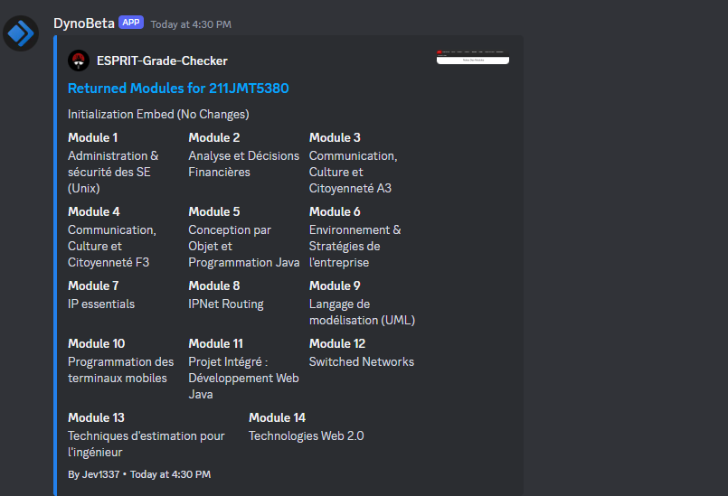

# ESPRIT Grade Checker

This project provides a script to check your grades on the ESPRIT student portal. It uses Selenium to automate the login process and scrape the grade information from the result page.

</img>

## Prerequisites

- Python 3.x
- Selenium
- Discord.py (for the Discord version)
- PyVirtualDisplay (for the Linux version)

## Installation

1. Clone the repository:

    ```bash
    git clone https://github.com/Jev1337/ESPRIT-Grade-Checker.git
    ```

2. Install the required dependencies:

    ```bash
    pip install selenium discord pyvirtualdisplay
    ```

3. Download the appropriate web driver for your platform and place it in the project directory (on Raspbian, it's better to use the already existing chromedriver):
    - For Windows: [ChromeDriver]([https://sites.google.com/a/chromium.org/chromedriver/downloads](https://googlechromelabs.github.io/chrome-for-testing/))
    - For Linux: [ChromeDriver]([https://sites.google.com/a/chromium.org/chromedriver/downloads](https://googlechromelabs.github.io/chrome-for-testing/)) and [Xvfb](https://www.x.org/releases/X11R7.6/doc/man/man1/Xvfb.1.xhtml)

## Usage

### Raspbian Version (raspbian_esprit_checker_discord.py)

1. Make sure you have a Discord bot token and a room ID where you want to send the message.

2. Open the `raspbian_esprit_checker_discord.py` file and replace the following placeholders with your own values:
    - `secret`: Your Discord bot token
    - `room_id`: The room ID where you want to send the message

3. Run the script:

    ```bash
    python raspbian_esprit_checker_discord.py
    ```

    The script will prompt you to enter your ESPRIT username and password. It will then continuously check for new grades every 60 seconds and send a notification to the specified Discord room whenever a new grade is added.

### Windows Version with Discord (windows_esprit_checker_discord.py)

1. Make sure you have a Discord bot token and a room ID where you want to send the message.

2. Open the `windows_esprit_checker_discord.py` file and replace the following placeholders with your own values:
    - `secret`: Your Discord bot token
    - `room_id`: The room ID where you want to send the message

3. Run the script:

    ```bash
    python windows_esprit_checker_discord.py
    ```

    The script will prompt you to enter your ESPRIT username and password. It will then continuously check for new grades every 60 seconds and send a notification to the specified Discord room whenever a new grade is added.

### Windows Version without Discord (windows_esprit_checker.py)

1. Open the `windows_esprit_checker.py` file.

2. Run the script:

    ```bash
    python windows_esprit_checker.py
    ```

    The script will prompt you to enter your ESPRIT username and password. It will then continuously check for new grades every 60 seconds and print the number of grades to the console whenever a new grade is added.

## License

This project is licensed under the MIT License - see the [LICENSE](LICENSE) file for details.
